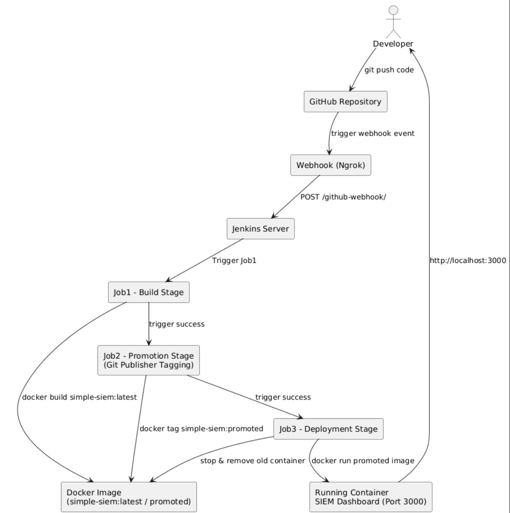
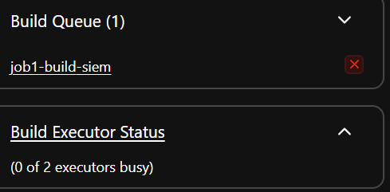
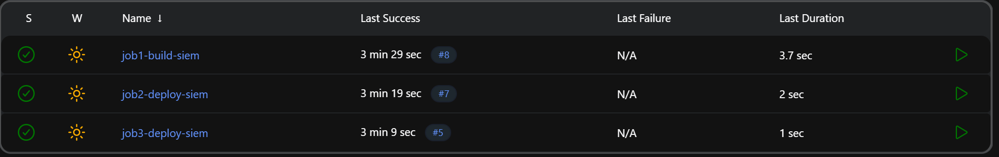
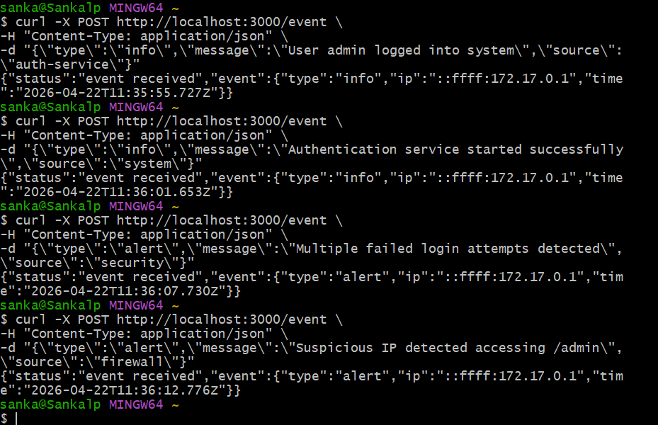
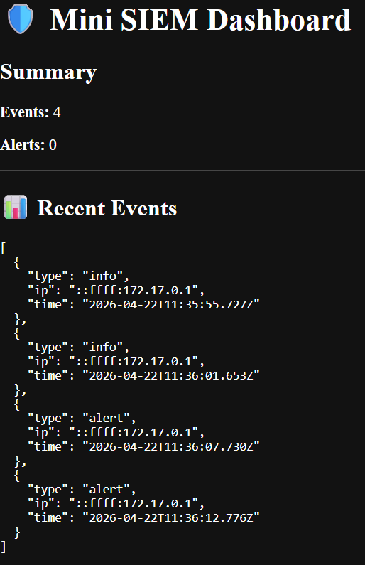

# CI/CD Pipeline – SIEM Project

- [CI/CD Pipeline – SIEM Project](#cicd-pipeline--siem-project)
  - [Overview](#overview)
  - [Diagram to represent the process:](#diagram-to-represent-the-process)
    - [What the diagram shows:](#what-the-diagram-shows)
  - [Tools Installed \& Why](#tools-installed--why)
    - [Docker](#docker)
    - [Jenkins (running via Docker container)](#jenkins-running-via-docker-container)
    - [Ngrok (Webhook exposure tool)](#ngrok-webhook-exposure-tool)
  - [Setting up Webhook](#setting-up-webhook)
    - [Payload URL:](#payload-url)
    - [Content type:](#content-type)
    - [Event trigger:](#event-trigger)
    - [⚠️ Issue encountered:](#️-issue-encountered)
  - [Jenkins Pipeline (3 Jobs Architecture)](#jenkins-pipeline-3-jobs-architecture)
    - [Job 1 – Build Stage (CI)](#job-1--build-stage-ci)
    - [Job 2 – Promotion Stage (CI/CD Bridge)](#job-2--promotion-stage-cicd-bridge)
    - [Job 3 – Deployment Stage (CD)](#job-3--deployment-stage-cd)
  - [Output in Jenkins](#output-in-jenkins)
    - [Job 1 console output:](#job-1-console-output)
    - [Job 2 console output:](#job-2-console-output)
    - [Job 3 console output:](#job-3-console-output)
    - [Jenkins UI after the CI/CD](#jenkins-ui-after-the-cicd)
  - [](#)
  - [Sending logs using CI/CD](#sending-logs-using-cicd)
    - [Normal logs:](#normal-logs)
    - [Alert logs](#alert-logs)
  - [Output of the logs on App dashboard](#output-of-the-logs-on-app-dashboard)

## Overview
This project demonstrates a full CI/CD pipeline using Jenkins, Docker, and GitHub.

---

## Diagram to represent the process:


### What the diagram shows:
1. GitHub push triggers Jenkins via webhook (Ngrok)
2. Job1 builds Docker image
3. Job2 promotes + tags image (Git Publisher stage)
4. Job3 deploys container
5. Final output = live SIEM dashboard

## Tools Installed & Why
### Docker

Used to:
* Build application images
* Run containers
* Promote versions between jobs

Key commands used:
```bash
docker build -t simple-siem .
docker run -d -p 3000:3000 simple-siem
```
### Jenkins (running via Docker container)

Installed using:
```bash
docker run -d -p 8080:8080 -p 50000:50000 --name jenkins-server jenkins/jenkins:lts
```
Used for:
* CI/CD job orchestration
* GitHub integration
* Triggering pipeline stages automatically

### Ngrok (Webhook exposure tool)

Installed locally (Windows executable):
```bash
./ngrok.exe http 8080
```
Used for:
* Exposing local Jenkins to GitHub
* Allowing GitHub webhooks to trigger Jenkins

Webhook URL generated: `https://previous-stinky-maturity.ngrok-free.dev/github-webhook/`

---
## Setting up Webhook
We configured:

Settings → Webhooks → Add webhook

### Payload URL:
```bash
https://<ngrok-url>/github-webhook/
```
### Content type:
```bash
application/json
```
### Event trigger:
```bash
Push events only
```
### ⚠️ Issue encountered:
* Webhook initially showed 404 error
* Fixed by ensuring:
  * Jenkins is running
  * Ngrok is active
  * Correct endpoint /github-webhook/

---

## Jenkins Pipeline (3 Jobs Architecture)
### Job 1 – Build Stage (CI)
**Purpose:**

Build Docker image from latest GitHub code

**Configuration:**
* Source Code: GitHub repo (main branch)
* Trigger: GitHub webhook (via ngrok)
* Build step: `docker build -t simple-siem .`

**Output:**
* Docker image created: `simple-siem:latest`
* Automatically triggers Job2

### Job 2 – Promotion Stage (CI/CD Bridge)
**Purpose:**
Validate and promote build artifact

**Key actions:**
* Confirms Docker image exists
* Tags image for release
```bash
docker tag simple-siem simple-siem:promoted
```
**Git Publisher (IMPORTANT PART):**

Used to:
* Push updated state back to GitHub if needed
* Maintain version tracking
**Output:**
* Promoted Docker image created
* Triggers Job3 automatically

### Job 3 – Deployment Stage (CD)
**Purpose:**
Deploy application container

**Actions:**
```bash
docker stop simple-siem || true
docker rm simple-siem || true

docker run -d -p 3000:3000 --name simple-siem simple-siem:promoted
```
**Output:**
Live SIEM dashboard running on:
`http://localhost:3000`

---
## Output in Jenkins


### Job 1 console output:
```bash
Started by GitHub push by sankalpdevopstrain
Running as SYSTEM
Building in workspace /var/jenkins_home/workspace/job1-build-siem
[WS-CLEANUP] Deleting project workspace...
[WS-CLEANUP] Deferred wipeout is used...
[WS-CLEANUP] Done
The recommended git tool is: NONE
No credentials specified
Cloning the remote Git repository
Cloning repository https://github.com/sankalpdevopstrain/simple-security-monitor.git
 > git init /var/jenkins_home/workspace/job1-build-siem # timeout=10
Fetching upstream changes from https://github.com/sankalpdevopstrain/simple-security-monitor.git
 > git --version # timeout=10
 > git --version # 'git version 2.47.3'
 > git fetch --tags --force --progress -- https://github.com/sankalpdevopstrain/simple-security-monitor.git +refs/heads/*:refs/remotes/origin/* # timeout=10
 > git config remote.origin.url https://github.com/sankalpdevopstrain/simple-security-monitor.git # timeout=10
 > git config --add remote.origin.fetch +refs/heads/*:refs/remotes/origin/* # timeout=10
Avoid second fetch
 > git rev-parse refs/remotes/origin/main^{commit} # timeout=10
Checking out Revision 9405e7da0d40474f1c7728af0240201dfa5f0d58 (refs/remotes/origin/main)
 > git config core.sparsecheckout # timeout=10
 > git checkout -f 9405e7da0d40474f1c7728af0240201dfa5f0d58 # timeout=10
Commit message: "CI/CD Process"
 > git rev-list --no-walk ff8bc10913f7a6502e8d66ec6b5f3cd3143116d2 # timeout=10
[job1-build-siem] $ /bin/sh -xe /tmp/jenkins5355332296836557414.sh
+ echo Starting SIEM Docker build...
Starting SIEM Docker build...
+ docker build -t simple-siem .
#0 building with "default" instance using docker driver

#1 [internal] load build definition from Dockerfile
#1 transferring dockerfile: 369B done
#1 DONE 0.0s

#2 [internal] load metadata for docker.io/library/node:alpine
#2 DONE 0.7s

#3 [internal] load .dockerignore
#3 transferring context: 2B done
#3 DONE 0.0s

#4 [internal] load build context
#4 transferring context: 1.02MB 0.1s done
#4 DONE 0.1s

#5 [1/5] FROM docker.io/library/node:alpine@sha256:bdf2cca6fe3dabd014ea60163eca3f0f7015fbd5c7ee1b0e9ccb4ced6eb02ef4
#5 resolve docker.io/library/node:alpine@sha256:bdf2cca6fe3dabd014ea60163eca3f0f7015fbd5c7ee1b0e9ccb4ced6eb02ef4 0.1s done
#5 DONE 0.1s

#6 [2/5] WORKDIR /app
#6 CACHED

#7 [3/5] COPY package*.json ./
#7 CACHED

#8 [4/5] RUN npm install
#8 CACHED

#9 [5/5] COPY . .
#9 DONE 0.2s

#10 exporting to image
#10 exporting layers
#10 exporting layers 0.2s done
#10 exporting manifest sha256:5143eeca1e5d035037dda67cb39b3d49af3e28d7473f62cee0137be4330c2a68 0.0s done
#10 exporting config sha256:f97a446951487193bb88e03efd5b9e74eb9c541de5e3d144588dba986abd8182 0.0s done
#10 exporting attestation manifest sha256:69eeec7d8b54b0aef38d51c0b8dfcd06bbe63f2ee3550ceee877ded64c1e4042
#10 exporting attestation manifest sha256:69eeec7d8b54b0aef38d51c0b8dfcd06bbe63f2ee3550ceee877ded64c1e4042 0.1s done
#10 exporting manifest list sha256:0f76b16abaebb9c42cb894142b5ca6360d75d35b89a383e548780a4bd90f0bfe 0.0s done
#10 naming to docker.io/library/simple-siem:latest 0.0s done
#10 unpacking to docker.io/library/simple-siem:latest 0.1s done
#10 DONE 0.6s
+ echo Build complete
Build complete
Triggering a new build of job2-deploy-siem
Finished: SUCCESS
```
### Job 2 console output:
```bash
Started by upstream project "job1-build-siem" build number 8
originally caused by:
 Started by GitHub push by sankalpdevopstrain
Running as SYSTEM
Building in workspace /var/jenkins_home/workspace/job2-deploy-siem
The recommended git tool is: NONE
using credential security-monitor-ssh
 > git rev-parse --resolve-git-dir /var/jenkins_home/workspace/job2-deploy-siem/.git # timeout=10
Fetching changes from the remote Git repository
 > git config remote.origin.url git@github.com:sankalpdevopstrain/simple-security-monitor.git # timeout=10
Fetching upstream changes from git@github.com:sankalpdevopstrain/simple-security-monitor.git
 > git --version # timeout=10
 > git --version # 'git version 2.47.3'
using GIT_SSH to set credentials 
[INFO] SELinux is present on the host and we could not confirm that it does not apply actively: will try to relabel temporary files now; this may complain if context labeling not applicable after all
 > /usr/bin/chcon --type=ssh_home_t /var/jenkins_home/workspace/job2-deploy-siem@tmp/jenkins-gitclient-ssh9554028610052300537.key
Verifying host key using known hosts file
 > git fetch --tags --force --progress -- git@github.com:sankalpdevopstrain/simple-security-monitor.git +refs/heads/*:refs/remotes/origin/* # timeout=10
 > git rev-parse refs/remotes/origin/main^{commit} # timeout=10
Checking out Revision 9405e7da0d40474f1c7728af0240201dfa5f0d58 (refs/remotes/origin/main)
 > git config core.sparsecheckout # timeout=10
 > git checkout -f 9405e7da0d40474f1c7728af0240201dfa5f0d58 # timeout=10
Commit message: "CI/CD Process"
 > git rev-list --no-walk ff8bc10913f7a6502e8d66ec6b5f3cd3143116d2 # timeout=10
[job2-deploy-siem] $ /bin/sh -xe /tmp/jenkins1920246146999977376.sh
+ echo 🚀 Job2: Promotion stage started
🚀 Job2: Promotion stage started
+ echo Checking Docker image from Job1...
Checking Docker image from Job1...
+ docker images
+ grep simple-siem
simple-siem       latest     0f76b16abaeb   9 seconds ago       252MB
simple-siem       promoted   0f6ea9894515   50 minutes ago      251MB
+ echo Tagging image as promoted build...
Tagging image as promoted build...
+ docker tag simple-siem simple-siem:promoted
+ echo Job2 completed successfully - ready for deployment
Job2 completed successfully - ready for deployment
The recommended git tool is: NONE
using credential security-monitor-ssh
Triggering a new build of job3-deploy-siem
Finished: SUCCESS
```
### Job 3 console output:
```bash
Started by upstream project "job2-deploy-siem" build number 7
originally caused by:
 Started by upstream project "job1-build-siem" build number 8
 originally caused by:
  Started by GitHub push by sankalpdevopstrain
Running as SYSTEM
Building in workspace /var/jenkins_home/workspace/job3-deploy-siem
[job3-deploy-siem] $ /bin/sh -xe /tmp/jenkins16704885515067898482.sh
+ echo 🚀 Job3: Deployment stage starting...
🚀 Job3: Deployment stage starting...
+ echo Cleaning old container...
Cleaning old container...
+ docker rm -f simple-siem
simple-siem
+ echo Checking promoted image...
Checking promoted image...
+ docker images
+ grep -q simple-siem
+ echo Running PROMOTED container...
Running PROMOTED container...
+ docker run -d -p 3000:3000 --name simple-siem simple-siem:promoted
21a0e598d4bbb70b8d12b24dc878e576e3734be800889232397c6f6f7e29ac9a
+ echo ✅ Deployment complete!
✅ Deployment complete!
+ echo App running on port 3000
App running on port 3000
Finished: SUCCESS
```
### Jenkins UI after the CI/CD

---
## Sending logs using CI/CD 
### Normal logs:
```bash
curl -X POST http://localhost:3000/event \
-H "Content-Type: application/json" \
-d "{\"type\":\"info\",\"message\":\"User admin logged into system\",\"source\":\"auth-service\"}"
```
```bash
curl -X POST http://localhost:3000/event \
-H "Content-Type: application/json" \
-d "{\"type\":\"info\",\"message\":\"Authentication service started successfully\",\"source\":\"system\"}"
```
### Alert logs
```bash
curl -X POST http://localhost:3000/event \
-H "Content-Type: application/json" \
-d "{\"type\":\"alert\",\"message\":\"Multiple failed login attempts detected\",\"source\":\"security\"}"
```
```bash
curl -X POST http://localhost:3000/event \
-H "Content-Type: application/json" \
-d "{\"type\":\"alert\",\"message\":\"Suspicious IP detected accessing /admin\",\"source\":\"firewall\"}"
```

## Output of the logs on App dashboard
