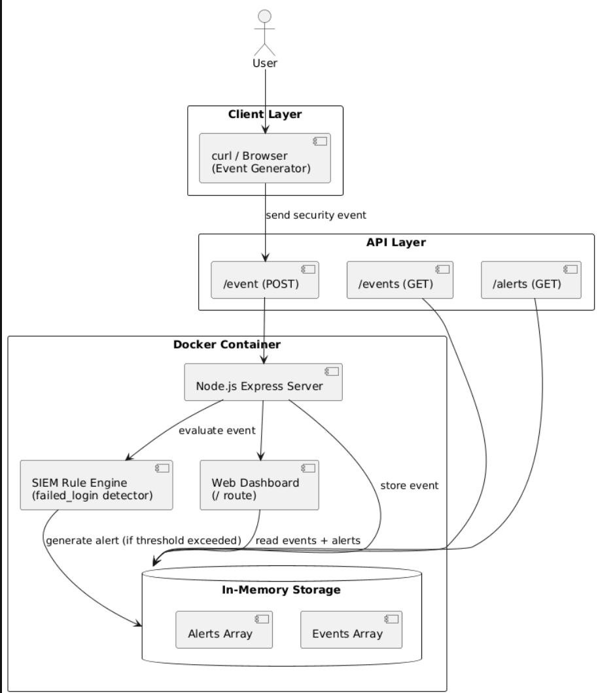
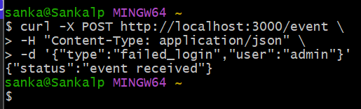
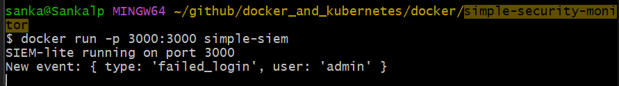
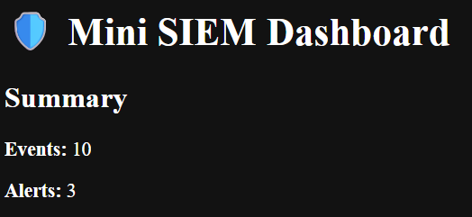
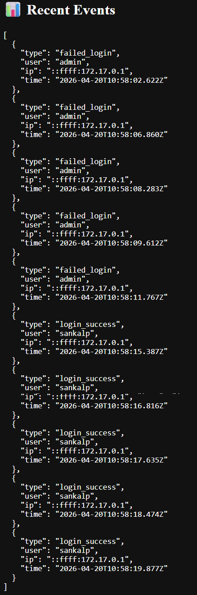
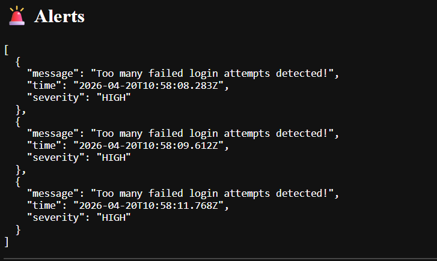

## Simple Security Monitor
- [Simple Security Monitor](#simple-security-monitor)
- [Overview](#overview)
- [Tech Stack](#tech-stack)
- [Core Features](#core-features)
- [Architecture](#architecture)
- [How It Works](#how-it-works)
- [Example Event Simulation](#example-event-simulation)
- [Docker Setup](#docker-setup)
  - [Build image:](#build-image)
  - [Run container:](#run-container)
- [Creating an event:](#creating-an-event)
- [Showing event in folder:](#showing-event-in-folder)
- [Dashboard:](#dashboard)
- [Recent events:](#recent-events)
- [Alerts:](#alerts)
- [Challenges \& Blockers](#challenges--blockers)
  - [1. Docker build failure (missing Dockerfile)](#1-docker-build-failure-missing-dockerfile)
  - [2. npm dependency / build issues](#2-npm-dependency--build-issues)
  - [3. Port allocation conflict](#3-port-allocation-conflict)
  - [4. Docker caching confusion](#4-docker-caching-confusion)
  - [5. Missing event display in dashboard](#5-missing-event-display-in-dashboard)
- [AI Usage Disclosure](#ai-usage-disclosure)

---
## Overview

This project is a lightweight **SIEM-like security monitoring system** built using **Node.js and Docker**.  
It simulates how security events are ingested, processed, and visualised in a basic dashboard.

The system allows fake or real events (e.g. failed logins) to be sent via API endpoints, stored in memory, and analysed using simple detection rules to generate alerts.

---

## Tech Stack

- Node.js (Express)
- Docker
- REST API (event ingestion)
- In-memory data storage
- Basic rule-based detection engine

---

## Core Features

- Event ingestion via `/event` endpoint
- Real-time event storage (in-memory)
- Simple detection rule (failed login threshold)
- JSON API for `/events` and `/alerts`
- Web dashboard for monitoring activity
- Fully containerised using Docker

---

## Architecture


---
## How It Works

1. Events are sent via HTTP POST requests
2. Server stores events in memory
3. A simple detection rule checks for repeated failed logins
4. If threshold is exceeded → alert is generated
5. Dashboard displays live system state

---

## Example Event Simulation

```bash
curl -X POST http://localhost:3000/event \
-H "Content-Type: application/json" \
-d '{"type":"failed_login","user":"admin"}'
```
---
## Docker Setup
### Build image:
```bash
docker build -t simple-siem
```
### Run container:
```bash
docker run -p 3000:3000 simple-siem
```
## Creating an event:


## Showing event in folder:


## Dashboard:


## Recent events:


## Alerts:


---
## Challenges & Blockers

During development, several issues were encountered and resolved:

### 1. Docker build failure (missing Dockerfile)
* Initial build failed due to missing Dockerfile in the directory.
* Resolved by correctly creating and placing Dockerfile in project root.
### 2. npm dependency / build issues
* Early container builds failed due to missing package.json or incorrect COPY steps.
* Fixed by properly structuring Dockerfile:
  * Copy only package*.json first
  * Run npm install
  * Then copy application source code
### 3. Port allocation conflict
* Error: port 3000 already allocated
* Caused by existing running container
* Resolved using: `docker stop ac2c1a698dc1`

### 4. Docker caching confusion

* Changes in `server.js` were not reflected immediately
* Root cause: Docker image snapshot behaviour
* Fixed by rebuilding image after code changes

### 5. Missing event display in dashboard

* Initial dashboard only showed event counts
* Improved by rendering full HTML table with event + alert logs

---
## AI Usage Disclosure

AI tools (ChatGPT) were used during development for:

- Assisting with Node.js Express scripting
- Debugging Docker build and runtime issues
- Improving SIEM detection logic structure

All implementation decisions were reviewed and tested manually.

